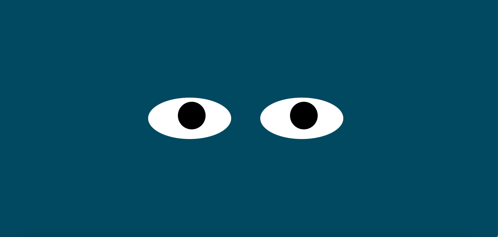

# Eye Exercise

## Description
This project simulates the movement of eyes following the cursor on the screen. It uses HTML, CSS, and JavaScript to create a pair of eyes that move in sync with the mouse pointer, giving the illusion of watching the cursor.

## How to Run
1. Clone the repository to your local machine.
2. Navigate to the project directory.
3. Open the `index.html` file in your preferred web browser.

## Roadmap of Future Improvements
Plans for future updates include adding more interactive elements to the page, such as different facial expressions and blink animations for the eyes. 

## License Information
This project is licensed under the MIT license. Please see the [license](./license)
 file for more details.

## Screenshot 

